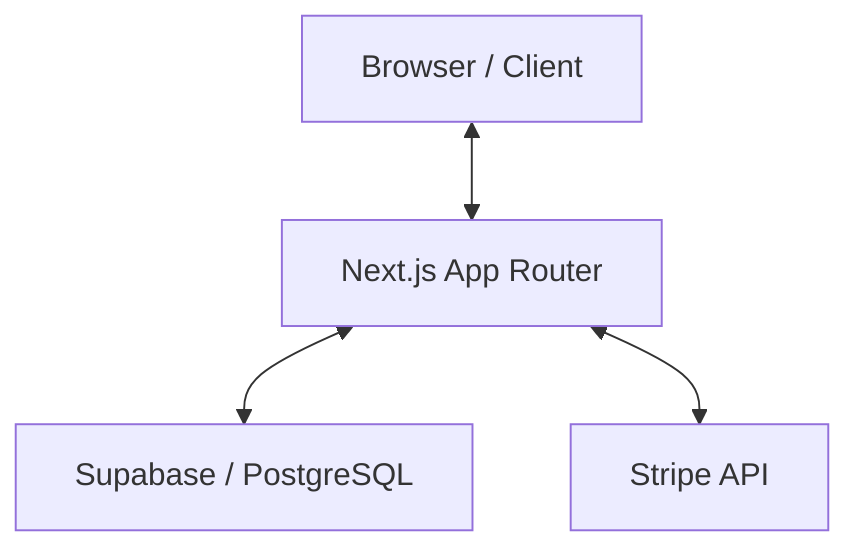

# OpenVeda Architecture Overview

This document provides a high-level overview of the OpenVeda system architecture, data flow, and key design decisions.

## High-Level Architecture

OpenVeda is a modern, full-stack Next.js application leveraging Server Components and a serverless database backend.

## Key Components

### 1. Routing (Next.js App Router)
- **`/`**: Landing page with "Student Spotlight" and program discovery.
- **`/organizations`**: Dynamic project discovery with multi-program filtering.
- **`/programs`**: Central launchpad for mentorship initiatives.
- **`/mentorship`**: Hub for expert connections and 1-on-1 sessions.
- **`/playbook/[slug]`**: Dynamic guide delivery powered by React Markdown.

### 2. Database (Supabase / PostgreSQL)
- **`organizations`**: Stores project metadata, tech stack, and program tags.
- **`playbooks`**: High-signal contributor guides linked to organizations.
- **`mentors`**: Bespoke profile data and tactical navigation links.
- **`proposals`**: User-generated content for community review.

### 3. State Management
- **Server State**: Managed via Supabase Auth and Server Actions.
- **Client State**: Minimal local state using React Hooks and URL search params for filtering.

### 4. Styling & Animations
- **Tailwind CSS**: Core utility styling.
- **Framer Motion**: Orchestrates all page transitions, stagger-fades, and interactive hover states.

## Data Flow

1. **User Authentication**: Handled via Supabase Auth (Magic Links / Social).
2. **Project Discovery**: Fetching and filtering project data from `organizations` table.
3. **Playbook Delivery**: Fetching markdown content from `playbooks` table and rendering via `react-markdown`.
4. **Mentorship Connection**: Dynamic profile generation from `mentors` table and third-party integration (Calendly).

---

For more details on styling, see [DESIGN_SYSTEM.md](./DESIGN_SYSTEM.md).
